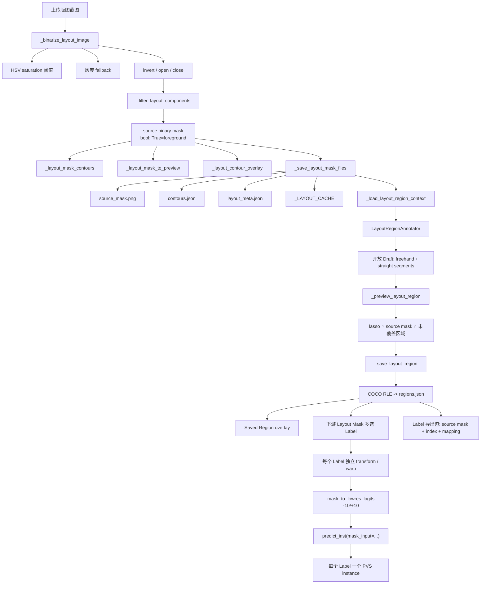

# 版图截图转掩码：模块、方法与实现流程

## 1. 文档范围

本文基于以下已验证源码版本整理：

- 分支：`Zhengqiyuan/PVS-demo`
- 基线 HEAD：`f3a469a Add per-Region layout PVS workflow and lasso editing`；本文同时描述当前 worktree 的单一 Label 工作流。
- 远端工作区：`/data/zhengqiyuan/sam3-gradio/.runtime/codex-worktrees/sam3-pvs-workspace`
- WebUI 入口：`sam3_gradio_demo.py`
- 独立图像处理模块：`scripts/layout_image_to_mask.py`
- Region 后端：`layout_region_utils.py`
- Region 前端：`layout_region_annotator/frontend/Index.svelte`
- Layout 变换：`layout_transform_utils.py`

本文说明“版图截图转掩码”页面本身，也说明它与下游 Layout Mask PVS prompt 的接口。PCS Auto、PVS Manual 和 SAM3 模型源码不在本文实现范围内。

> 文中的代码块分为完整函数和“关键路径摘录”。摘录保留当前源码的实际算法、调用关系和数据语义，但会省略冗长状态文本、无关 UI 参数或重复错误分支；最终行为以标注的源码函数为准。

## 2. 总体数据流



核心权威关系：

```text
source screenshot
    -> source binary mask（版图基础几何）
        -> contour（派生预览/导出）
        -> Label mask（一个套索与 source mask 的交集）
            -> COCO RLE（Label/Region 唯一权威几何）
                -> Layout PVS mask_input（下游推理输入）
```

最终业务语义：

- 一个完成并保存的套索对应一个 Region，也对应一个面向用户的唯一 `label`。
- Label 名称可选；空白名称在分配 Region ID 后自动写为 `Label N`，其中 `N=region_id`。
- 新数据不再有 category、细类或“区域/模块名称”两级结构。
- 历史记录中的 `class_label` 与 `name` 只用于兼容读取；加载后归一为单一 `label`，不会重新形成分类层级。
- Layout Mask 选择器只提供 `全部版图 mask` 和活动 Label；Label 选项支持多选。
- 每个选中 Label 是独立变换组，拥有自己的 `tx`、`ty`、`scale`、`rotation`、`alpha` 和 affine matrix。
- 当前激活的 Label 决定下方数值控件显示与修改的 transform；修改一个 Label 不改变其他 Label。
- 推理时每个 Label 分别解码 RLE、warp、调用一次 SAM3，并创建一个 PVS instance；批次仍按全有或全无提交。

## 3. 模块地图

| 页面模块 | 主要文件 | 关键函数 / method | 职责 |
|---|---|---|---|
| 上传和参数 | `sam3_gradio_demo.py` | `create_demo()` | 定义截图上传、threshold、invert、形态学、连通域等控件。 |
| 颜色提取 | `scripts/layout_image_to_mask.py` | `extract_layout_mask()` | 从 RGB 转 HSV，以饱和度/亮度/色差规则提取彩色版图像素。 |
| WebUI 二值化 | `sam3_gradio_demo.py` | `_binarize_layout_image()` | 调用颜色提取，提供灰度 fallback、invert、open、close。 |
| 连通域筛选 | `sam3_gradio_demo.py` | `_filter_layout_components()` | 删除小组件或只保留最大组件。 |
| contour | `sam3_gradio_demo.py` | `_layout_mask_contours()` | 生成外轮廓/孔洞、bbox、area 和点序列。 |
| mask 预览 | `sam3_gradio_demo.py` | `_layout_mask_to_preview()` | 把 bool mask 显示为黑前景、白背景。 |
| contour overlay | `sam3_gradio_demo.py` | `_layout_contour_overlay()` | 原图上叠加绿色 mask、外边界和孔洞边界。 |
| 横向预览分页 | `sam3_gradio_demo.py` | `layout-preview-pager` CSS | 将 binary mask 与 contour overlay 放在同一横向滑轨。 |
| 保存/恢复 | `sam3_gradio_demo.py` | `_save_layout_mask_files()`、`_layout_cache_put()`、`_restore_layout_cache_from_disk()` | 写盘、hash、cache 和恢复。 |
| 下载边界 | `sam3_gradio_demo.py`、`public_download_utils.py` | `_run_layout_mask_page_with_downloads()`、`_publish_layout_downloads()` | 将内部文件复制到受控 public download 目录。 |
| Region 组件边界 | `layoutregionannotator.py` | `preprocess()`、`postprocess()` | 浏览器只提交 client intent；服务端下发完整 canonical payload。 |
| Region Canvas | `Index.svelte` | `onPointerDown/Move/Up()`、`finishDraft()` | 自由线、直线顶点、显式完成和一次 input dispatch。 |
| Region 几何 | `layout_region_utils.py` | `normalize_lasso_points()`、`rasterize_uncovered_region_mask()` | 校验点并裁剪到 source mask 与未覆盖像素。 |
| Region RLE | `layout_region_utils.py` | `encode_binary_mask()`、`decode_binary_mask()` | pycocotools 压缩 COCO RLE 编解码。 |
| Region store | `layout_region_utils.py` | `LayoutRegionStore` | revision、跨进程锁、原子保存、恢复和软删除。 |
| Region overlay | `layout_region_utils.py` | `render_draft_region_overlay()`、`render_saved_region_overlay()` | 黄色 Draft、绿色 Saved Region。 |
| 下游 affine | `layout_transform_utils.py` | `build_layout_affine_matrix()`、`warp_layout_mask()` | source mask 到目标图像的权威仿射变换。 |
| 下游 SAM3 prompt | `sam3_gradio_demo.py` | `_mask_to_lowres_logits()`、`_predict_inst()` | bool mask 转低分辨率 logits 并传入 `predict_inst(mask_input=...)`。 |
| 按 Label 创建实例 | `sam3_gradio_demo.py` | `_create_pvs_from_layout_selection()` | 多选 Label 各自独立 transform、推理，并在全部成功后原子提交。 |

## 4. 权威数据、像素语义和文件格式

### 4.1 内部 bool mask

Python 内部统一使用二维 bool 数组：

- `True`：foreground。
- `False`：background。
- contour、Region、affine warp 和 prompt logits 都从这个 bool mask 派生。

### 4.2 WebUI 保存文件与 UI 预览的颜色不同

WebUI 保存 `source_mask.png` 时使用：

```python
cv2.imwrite(str(mask_path), mask_bool.astype(np.uint8) * 255)
```

因此磁盘文件语义是：

- 255 / 白色：foreground。
- 0 / 黑色：background。

但页面上的 binary mask 预览为了视觉习惯使用黑前景、白背景：

```python
def _layout_mask_to_preview(mask):
    mask = np.asarray(mask, dtype=bool)
    preview = np.where(mask, 0, 255).astype(np.uint8)
    return Image.fromarray(preview, mode="L").convert("RGB")
```

预览颜色不是权威数据语义；权威语义始终是 bool `True=foreground`。

### 4.3 独立 CLI 的 legacy 输出

`scripts/layout_image_to_mask.py` 的 `write_black_on_white()` 为兼容历史资产，写出黑前景、白背景：

```python
def write_black_on_white(path: Path, foreground: np.ndarray) -> None:
    path.parent.mkdir(parents=True, exist_ok=True)
    gray = np.where(foreground.astype(bool), 0, 255).astype(np.uint8)
    cv2.imwrite(str(path), cv2.cvtColor(gray, cv2.COLOR_GRAY2BGR))
```

所以：

- WebUI 内部 `source_mask.png`：白前景。
- 独立 CLI `*_binary_black_on_white.png`：黑前景。
- 两者进入算法后都必须先还原为 bool foreground，不能仅凭 PNG 颜色猜测语义。

## 5. 页面模块一：上传与参数

页面控件定义在 `create_demo()`：

```python
with gr.TabItem("版图截图转掩码", id="tab_layout_mask"):
    gr.Markdown("### 版图截图转二值 mask")
    gr.Markdown("binary mask 是唯一权威数据；contour 仅用于预览和导出。")
    with gr.Row():
        with gr.Column(scale=1):
            layout_input = gr.Image(
                type="numpy",
                label="上传版图截图",
                show_label=False,
                sources=["upload", "clipboard"],
            )
            layout_threshold = gr.Slider(
                minimum=0,
                maximum=255,
                value=12,
                step=1,
                label="threshold（色彩/饱和度阈值）",
            )
            layout_invert = gr.Checkbox(
                value=False,
                label="invert（反转前景/背景）",
            )
            with gr.Row():
                layout_open_kernel = gr.Slider(
                    minimum=0, maximum=31, value=0, step=1,
                    label="open kernel",
                )
                layout_close_kernel = gr.Slider(
                    minimum=0, maximum=31, value=0, step=1,
                    label="close kernel",
                )
            layout_morph_pixels = gr.Slider(
                minimum=-31,
                maximum=31,
                value=0,
                step=1,
                label="膨胀/腐蚀像素（正数膨胀，负数腐蚀）",
            )
            layout_min_area = gr.Number(
                value=0,
                precision=0,
                label="min component area",
            )
            layout_region_mode = gr.Radio(
                choices=[("全部区域", "all"), ("最大连通区域", "largest")],
                value="all",
                label="区域模式",
            )
```

参数作用：

| 参数 | 实现 |
|---|---|
| `threshold` | WebUI 作为 `saturation_min` 传给 `extract_layout_mask()`。 |
| `invert` | 在颜色/灰度提取后执行 `mask = ~mask`。 |
| `open kernel` | 椭圆核 `MORPH_OPEN`，去除小噪点和细小凸起。 |
| `close kernel` | 椭圆核 `MORPH_CLOSE`，连接小断点并填补窄缝。 |
| `膨胀/腐蚀像素` | `0` 不处理；正数以对应像素为半径膨胀前景，负数以绝对值像素为半径腐蚀前景，后端限制为 `-31…31`。 |
| `min component area` | 8 邻域连通组件面积过滤。 |
| `all` | 保留所有通过面积过滤的组件。 |
| `largest` | 只保留面积最大的有效组件。 |

## 6. 页面模块二：颜色提取与二值化

### 6.1 `extract_layout_mask()`

独立模块的核心颜色提取函数：

```python
def extract_layout_mask(
    image_rgb: np.ndarray,
    saturation_min: int = 12,
    value_min: int = 90,
    chroma_min: int = 0,
) -> np.ndarray:
    """Extract colored layout linework as a foreground boolean mask."""
    hsv = cv2.cvtColor(image_rgb, cv2.COLOR_RGB2HSV)
    saturation = hsv[..., 1]
    value = hsv[..., 2]
    mask = (saturation >= saturation_min) & (value >= value_min)
    if chroma_min > 0:
        rgb_i = image_rgb.astype(np.int16)
        chroma = rgb_i.max(axis=2) - rgb_i.min(axis=2)
        mask &= chroma >= chroma_min
    return mask.astype(bool)
```

method：

1. RGB 转 HSV。
2. 以 `saturation >= saturation_min` 识别彩色像素。
3. 以 `value >= value_min` 排除过暗像素。
4. 如果 `chroma_min > 0`，再要求 `max(R,G,B)-min(R,G,B)` 达到阈值。
5. 返回 bool mask。

### 6.2 WebUI 实际调用 `_binarize_layout_image()`

```python
def _binarize_layout_image(
    input_image,
    threshold=12,
    invert=False,
    open_kernel=0,
    close_kernel=0,
    morph_pixels=0,
):
    image = _pil_image(input_image)
    if image is None:
        raise ValueError("请先上传版图截图")
    rgb = np.asarray(image.convert("RGB"), dtype=np.uint8)
    threshold = int(np.clip(int(threshold), 0, 255))
    if _layout_extract_mask is not None:
        mask = _layout_extract_mask(
            rgb,
            saturation_min=max(1, threshold),
            value_min=1,
            chroma_min=0,
        )
    else:
        hsv = cv2.cvtColor(rgb, cv2.COLOR_RGB2HSV)
        mask = hsv[..., 1] >= max(1, threshold)
    if not np.asarray(mask).any():
        gray = cv2.cvtColor(rgb, cv2.COLOR_RGB2GRAY)
        mask = gray <= max(1, 255 - threshold)
    mask = np.asarray(mask, dtype=bool)
    if invert:
        mask = ~mask
    open_kernel = int(max(0, open_kernel or 0))
    close_kernel = int(max(0, close_kernel or 0))
    work = mask.astype(np.uint8)
    if open_kernel > 1:
        k = cv2.getStructuringElement(
            cv2.MORPH_ELLIPSE,
            (open_kernel, open_kernel),
        )
        work = cv2.morphologyEx(
            work,
            cv2.MORPH_OPEN,
            k,
            iterations=1,
        )
    if close_kernel > 1:
        k = cv2.getStructuringElement(
            cv2.MORPH_ELLIPSE,
            (close_kernel, close_kernel),
        )
        work = cv2.morphologyEx(
            work,
            cv2.MORPH_CLOSE,
            k,
            iterations=1,
        )
    work = _apply_layout_mask_morphology(work, morph_pixels)
    return image, work.astype(bool)
```

重要区别：

- 独立函数默认 `value_min=90`。
- WebUI 明确传入 `value_min=1`、`chroma_min=0`。
- 因此 WebUI 的 threshold 主要是饱和度阈值，而不是完整 HSV 三参数调节器。
- 如果彩色规则得到空 mask，WebUI 会自动使用灰度规则：`gray <= 255-threshold`。
- fallback 只在彩色结果完全为空时触发，不会与彩色结果合并。
### 6.3 有符号膨胀/腐蚀 `_apply_layout_mask_morphology()`

该参数表示前景边界调整的像素半径，处理顺序为：

```text
颜色提取 → invert → open → close → 有符号膨胀/腐蚀 → 连通域过滤
```

核心实现：

```python
_LAYOUT_MASK_MORPH_LIMIT_PX = 31


def _normalize_layout_morph_pixels(value):
    return int(np.clip(
        int(value or 0),
        -_LAYOUT_MASK_MORPH_LIMIT_PX,
        _LAYOUT_MASK_MORPH_LIMIT_PX,
    ))


def _apply_layout_mask_morphology(mask, morph_pixels=0):
    mask = np.asarray(mask, dtype=bool)
    pixels = _normalize_layout_morph_pixels(morph_pixels)
    if pixels == 0:
        return mask.copy()
    radius = abs(pixels)
    kernel_size = radius * 2 + 1
    kernel = cv2.getStructuringElement(
        cv2.MORPH_ELLIPSE,
        (kernel_size, kernel_size),
    )
    operation = cv2.dilate if pixels > 0 else cv2.erode
    result = operation(
        mask.astype(np.uint8),
        kernel,
        iterations=1,
        borderType=cv2.BORDER_CONSTANT,
        borderValue=0,
    )
    return result.astype(bool)
```

- `morph_pixels > 0`：膨胀前景。
- `morph_pixels < 0`：腐蚀前景。
- `morph_pixels == 0`：复制原 mask，不改变像素。
- 使用 `2 * abs(morph_pixels) + 1` 的椭圆核，使数值表示边界调整半径而不是 kernel 边长。
- 图像外部按背景值 `0` 处理；结果仍裁剪在原画布尺寸内。
- UI 和后端统一限制为 `-31…31`。


### 6.4 `ccfill_mask()`：当前仅供离线/CLI

`ccfill_mask()` 位于同一脚本，但“版图截图转掩码”页面没有调用它。

```python
def ccfill_mask(
    foreground: np.ndarray,
    gap: float = 2.5,
    method: str = "distance",
    close_kernel_size: Optional[int] = None,
    close_shape: str = "rect",
) -> np.ndarray:
    """Fill narrow enclosed background components."""
    mask = foreground.astype(bool)

    if method == "distance":
        working = mask.copy()
        background = (~working).astype(np.uint8)
        distance = cv2.distanceTransform(background, cv2.DIST_L2, 5)
    elif method == "close_fill":
        kernel_size = (
            close_kernel_size
            if close_kernel_size is not None
            else gap_to_kernel_size(gap)
        )
        working_u8 = mask.astype(np.uint8)
        if kernel_size > 1:
            working_u8 = cv2.morphologyEx(
                working_u8,
                cv2.MORPH_CLOSE,
                _kernel(close_shape, kernel_size),
                iterations=1,
            )
        working = working_u8.astype(bool)
        background = (~working).astype(np.uint8)
        distance = None
    else:
        raise ValueError(f"Unsupported ccfill method: {method}")

    num_labels, labels, _, _ = cv2.connectedComponentsWithStats(background, 8)
    border_labels = set(np.unique(labels[0, :]).tolist())
    border_labels.update(np.unique(labels[-1, :]).tolist())
    border_labels.update(np.unique(labels[:, 0]).tolist())
    border_labels.update(np.unique(labels[:, -1]).tolist())

    filled = working.astype(bool)
    for label in range(1, num_labels):
        if label in border_labels:
            continue
        component = labels == label
        if method == "distance" and float(distance[component].max()) > gap:
            continue
        filled[component] = True
    return filled
```

两种 method：

- `distance`：仅填充不接触图像边界、且最大 distance 不超过 `gap` 的封闭背景组件。
- `close_fill`：先形态学 close，再填充所有不接触边界的背景组件。

当前 WebUI 的 close slider 只执行 `MORPH_CLOSE`，不会继续执行 `ccfill_mask()` 的封闭背景组件遍历。

## 7. 页面模块三：连通域过滤

```python
def _filter_layout_components(mask, min_component_area=0, region_mode="all"):
    mask = np.asarray(mask, dtype=bool)
    min_area = max(0, int(min_component_area or 0))
    region_mode = str(region_mode or "all")
    if not mask.any():
        return mask.astype(bool)
    num_labels, labels, stats, _ = cv2.connectedComponentsWithStats(
        mask.astype(np.uint8),
        8,
    )
    if num_labels <= 1:
        return mask.astype(bool)
    component_ids = list(range(1, num_labels))
    if min_area > 0:
        component_ids = [
            idx for idx in component_ids
            if int(stats[idx, cv2.CC_STAT_AREA]) >= min_area
        ]
    if region_mode == "largest" and component_ids:
        component_ids = [
            max(component_ids, key=lambda idx: int(stats[idx, cv2.CC_STAT_AREA]))
        ]
    filtered = np.isin(labels, component_ids)
    return filtered.astype(bool)
```

实现语义：

- connectivity 固定为 8。
- label 0 是背景，不进入候选。
- 先应用 `min_component_area`。
- `largest` 在过滤后的组件中选最大项。
- 如果过滤后没有组件，输出全 False；上层会以 empty mask 错误拒绝保存。

## 8. 页面模块四：contour 与 overlay

### 8.1 contour 提取

```python
def _layout_mask_contours(mask):
    mask_u8 = np.asarray(mask, dtype=np.uint8)
    contours, hierarchy = cv2.findContours(
        mask_u8,
        cv2.RETR_CCOMP,
        cv2.CHAIN_APPROX_SIMPLE,
    )
    hierarchy_rows = hierarchy[0] if hierarchy is not None else []
    rows = []
    for idx, contour in enumerate(contours):
        if contour.shape[0] < 3:
            continue
        points = contour.reshape(-1, 2).astype(float).tolist()
        x, y, w, h = cv2.boundingRect(contour)
        parent = int(hierarchy_rows[idx][3]) if len(hierarchy_rows) else -1
        rows.append({
            "id": idx + 1,
            "is_hole": parent >= 0,
            "area": float(cv2.contourArea(contour)),
            "bbox_xywh": [float(x), float(y), float(w), float(h)],
            "points": points,
        })
    return rows
```

method：

- `RETR_CCOMP` 保留两级轮廓层级，因此可以标记孔洞。
- `CHAIN_APPROX_SIMPLE` 压缩水平、垂直和斜线段中的冗余点。
- `is_hole` 由 hierarchy 的 parent 判断。
- contour 是派生数据；不会反向重建或覆盖 source binary mask。

### 8.2 contour overlay

```python
def _layout_contour_overlay(image, mask, contours):
    base = np.asarray(_pil_image(image).convert("RGB"), dtype=np.uint8).copy()
    mask = np.asarray(mask, dtype=bool)
    fill = base.copy()
    fill[mask] = (40, 220, 80)
    vis = cv2.addWeighted(fill, 0.32, base, 0.68, 0)
    for item in contours:
        pts = np.asarray(
            item.get("points", []),
            dtype=np.int32,
        ).reshape((-1, 1, 2))
        if pts.shape[0] < 3:
            continue
        color = (255, 60, 60) if item.get("is_hole") else (0, 255, 80)
        cv2.polylines(vis, [pts], True, (0, 0, 0), 4)
        cv2.polylines(vis, [pts], True, color, 2)
    return Image.fromarray(vis)
```

显示规则：

- mask 填充：绿色。
- 混合权重：填充层 0.32、原图 0.68。
- 先画 4 px 黑色底边，再画 2 px 彩色边。
- 外轮廓为绿色，孔洞为红色。

### 8.3 binary mask / contour 横向滑页

```python
with gr.Row(elem_classes="layout-preview-pager"):
    with gr.Column(elem_classes="layout-preview-page"):
        gr.Markdown("#### binary mask 预览")
        layout_mask_preview = gr.Image(
            type="pil", label="binary mask 预览", show_label=False
        )
    with gr.Column(elem_classes="layout-preview-page"):
        gr.Markdown("#### contour overlay")
        layout_overlay_preview = gr.Image(
            type="pil", label="contour overlay", show_label=False
        )
```

```css
.layout-preview-pager {
    display: flex !important;
    flex-wrap: nowrap !important;
    gap: 12px;
    overflow-x: auto !important;
    overscroll-behavior-x: contain;
    scroll-behavior: smooth;
    scroll-snap-type: x mandatory;
    scrollbar-gutter: stable;
    padding-bottom: 8px;
}
.layout-preview-page {
    flex: 0 0 100% !important;
    min-width: 100% !important;
    scroll-snap-align: start;
    scroll-snap-stop: always;
}
```

这里只改变布局；两个 `gr.Image` 仍是原 callback 的独立输出。

## 9. 页面模块五：生成、保存和下载

### 9.1 主 callback `_run_layout_mask_page()`（关键路径摘录）

以下摘录保留实际处理步骤、返回值顺序和失败清理逻辑；成功状态文本已缩短，完整统计信息见源码函数。

```python
def _run_layout_mask_page(
    session_state,
    image_state,
    input_image,
    threshold,
    invert,
    open_kernel,
    close_kernel,
    min_component_area,
    region_mode,
    morph_pixels=0,
):
    try:
        image, mask = _binarize_layout_image(
            input_image, threshold, invert, open_kernel, close_kernel, morph_pixels
        )
        mask = _filter_layout_components(
            mask, min_component_area, region_mode
        )
        if not mask.any():
            raise ValueError("Binary mask is empty; lower threshold or check invert")
        contours = _layout_mask_contours(mask)
        params = {
            "threshold": int(threshold),
            "invert": bool(invert),
            "open_kernel": int(open_kernel or 0),
            "close_kernel": int(close_kernel or 0),
            "morph_pixels": _normalize_layout_morph_pixels(morph_pixels),
            "min_component_area": int(min_component_area or 0),
            "region_mode": str(region_mode or "all"),
        }
        state, mask_path, contour_path, overlay = _save_layout_mask_files(
            session_state, image, mask, contours, params
        )
        editor_payload = _layout_editor_payload(
            image_state,
            state,
            "版图 mask 已生成；切换到版图 mask 提示分割后可拖动、缩放和旋转。",
        )
        return (
            state,
            editor_payload,
            image,
            _layout_mask_to_preview(mask),
            overlay,
            mask_path,
            contour_path,
            "版图 mask 已生成",
        )
    except Exception as exc:
        info = f"版图 mask 生成失败：{exc}"
        state = _new_layout_state(_session_id_from_state(session_state))
        return (
            state,
            _layout_editor_empty(image_state, info),
            None, None, None, None, None,
            info,
        )
```

成功返回 8 个值，顺序固定：

1. `layout_state`。
2. 下游 `LayoutTransformEditor` payload。
3. 隐藏的 source preview。
4. binary mask preview。
5. contour overlay。
6. mask 下载路径。
7. contour JSON 下载路径。
8. 状态文本。

### 9.2 写盘与 cache

`_save_layout_mask_files()` 的关键写盘逻辑：

```python
session_id = _session_id_from_state(session_state)
layout_id = (
    f"layout_{time.strftime('%Y%m%d_%H%M%S')}_"
    f"{uuid.uuid4().hex[:8]}"
)
out_dir = _layout_disk_dir(session_id, layout_id)
out_dir.mkdir(parents=True, exist_ok=False)

image_path = out_dir / "source_image.png"
mask_path = out_dir / "source_mask.png"
contour_path = out_dir / "contours.json"
overlay_path = out_dir / "contour_overlay.png"
meta_path = out_dir / "layout_meta.json"

image.save(image_path)
cv2.imwrite(str(mask_path), mask_bool.astype(np.uint8) * 255)
overlay = _layout_contour_overlay(image, mask_bool, contours)
overlay.save(overlay_path)

cached = _layout_cache_put(
    session_id,
    layout_id,
    image,
    mask_bool,
    contours,
    params,
    mask_path=mask_path,
    contour_json_path=contour_path,
    overlay_path=overlay_path,
    layout_meta_path=meta_path,
)
```

目录结构：

```text
.runtime/layout_masks/<session_id>/<layout_id>/
├── source_image.png
├── source_mask.png
├── contours.json
├── contour_overlay.png
└── layout_meta.json
```

`layout_meta.json` 保存：

- session/layout identity。
- source mask 文件 hash 与像素 hash。
- source dimensions。
- foreground bbox 与 pivot。
- 当前 committed transform revision、matrix。
- 二值化参数。
- contour 派生数据。

### 9.3 cache 恢复校验

```python
file_hash = _layout_tx.file_sha256(mask_path)
if (
    meta.get("source_mask_file_sha256")
    and meta.get("source_mask_file_sha256") != file_hash
):
    raise ValueError("版图 source_mask.png 文件 hash 不匹配，拒绝恢复缓存")

gray = cv2.imread(str(mask_path), cv2.IMREAD_GRAYSCALE)
source_mask = gray >= 128
pixel_hash = _layout_tx.mask_pixel_sha256(source_mask.astype(np.uint8))
if (
    meta.get("source_mask_pixel_sha256")
    and meta.get("source_mask_pixel_sha256") != pixel_hash
):
    raise ValueError("版图 source mask 像素 hash 不匹配，拒绝恢复缓存")
```

file hash 保护 PNG 文件字节；pixel hash 保护解码后的实际几何。

### 9.4 下载发布

`_run_layout_mask_page_with_downloads()` 在内部生成成功后调用 `_publish_layout_downloads()`：

- 内部 runtime 文件不直接暴露给浏览器。
- 下载副本进入随机 public download 目录。
- 发布失败只取消下载路径，不删除内部权威 mask。
- 状态文本中的内部路径会替换为 public path。

### 9.5 Region Label 标注导出包

`导出当前 Region 标注` 不直接暴露 `.runtime` 文档。服务端重新验证 session、layout、source-mask hash 和 `regions_revision` 后，在公开下载目录生成包含五个核心文件及逐 Label 二值图的 zip：

```text
source_mask.png
region_label_index.png
labels.json
regions.json
manifest.json
label_masks/
  label_<index>_R<region_id>.png
```

- `source_mask.png`：完整权威二值版图 mask，白色 `255` 为 source foreground。
- `region_label_index.png`：单通道 `uint16` 标签索引图；每个活动 Label 的像素值为 `labels.json` 中连续分配的 `index`。
- 索引值 `0`：背景或尚未被套索 Label 覆盖的 source-mask 前景，两种情况都可结合 `source_mask.png` 区分。
- `label_masks/*.png`：每个活动 Label 一张独立 8-bit 灰度二值图，`0` 为背景、`255` 为该 Label 前景；软删除记录不生成二值图。
- `labels.json`：记录 `index`、`region_id`、`label`、`mask_file` 及派生统计，不用颜色或文件名承载 Label 语义。
- `regions.json`：包含完整权威 COCO RLE、revision、软删除历史及 metadata。
- `manifest.json`：记录 schema、identity、hash、revision 和包内文件说明。

索引图由服务端逐条解码活动 RLE 重新生成；浏览器提交的 overlay、area、bbox 或 label index 都不作为导出输入。

## 10. 页面 callback 串联

```python
run_layout_mask_event = run_layout_mask_btn.click(
    fn=_run_layout_mask_page_with_downloads,
    inputs=[
        session_state, image_state, layout_input,
        layout_threshold, layout_invert,
        layout_open_kernel, layout_close_kernel,
        layout_min_area, layout_region_mode,
        layout_morph_pixels,
    ],
    outputs=[
        layout_state, layout_editor, layout_source_preview,
        layout_mask_preview, layout_overlay_preview,
        layout_mask_file, layout_contour_file, layout_info,
    ],
    concurrency_limit=1,
)

run_layout_region_event = run_layout_mask_event.then(
    fn=_load_layout_region_context,
    inputs=[layout_state],
    outputs=[
        layout_region_state, layout_region_annotator,
        layout_region_label, layout_region_selector, save_layout_region_btn,
        delete_layout_region_btn, layout_region_status,
    ],
    concurrency_limit=1,
)

run_layout_region_event.then(
    fn=_reset_layout_prompt_selection,
    inputs=[image_state, layout_state],
    outputs=[layout_state, layout_editor, layout_prompt_mask_selector],
    concurrency_limit=1,
)
```

生成新 mask 后会依次：

1. 生成并写入新的 `layout_id`。
2. 初始化该 layout 的 Region 上下文。
3. 将下游 Layout prompt 选择重置为完整 mask，防止旧 Label 多选与 transform 污染新 layout。

清除按钮：

- 清除当前页面 state 和内存 cache。
- 清空 Region UI。
- 不主动删除磁盘上的历史 layout/regions 文件。
- 推进 prompt epoch，使运行中的旧批次在提交前被拒绝。

## 11. 页面模块六：Region Custom Component 数据边界

canonical payload：

```json
{
  "server_view": {
    "enabled": true,
    "source_image": "data:image/png;base64,...",
    "source_mask_image": "data:image/png;base64,...",
    "saved_region_overlay_image": "data:image/png;base64,...",
    "draft_region_overlay_image": "data:image/png;base64,...",
    "natural_width": 800,
    "natural_height": 600,
    "regions_revision": 3,
    "selected_region_id": 2,
    "regions": [],
    "status": ""
  },
  "client_intent": {
    "tool_mode": "lasso",
    "lasso_polygon": [[10, 20], [30, 40]],
    "expected_regions_revision": 3,
    "session_id": "",
    "layout_id": "",
    "source_mask_hash": ""
  }
}
```

`preprocess()` 的白名单实现：

```python
def preprocess(self, payload: Any) -> dict[str, Any]:
    raw = self._unwrap(payload)
    if not isinstance(raw, dict):
        return {
            "tool_mode": "browse",
            "lasso_polygon": [],
            "expected_regions_revision": None,
            "session_id": "",
            "layout_id": "",
            "source_mask_hash": "",
        }
    intent = raw.get("client_intent")
    if not isinstance(intent, dict):
        intent = raw
    tool_mode = intent.get("tool_mode")
    if tool_mode not in {"browse", "lasso"}:
        tool_mode = "browse"
    polygon = intent.get("lasso_polygon")
    if not isinstance(polygon, list):
        polygon = []
    revision = intent.get("expected_regions_revision")
    if isinstance(revision, bool) or not isinstance(revision, int):
        revision = None
    return {
        "tool_mode": tool_mode,
        "lasso_polygon": polygon,
        "expected_regions_revision": revision,
        "session_id": str(intent.get("session_id") or ""),
        "layout_id": str(intent.get("layout_id") or ""),
        "source_mask_hash": str(intent.get("source_mask_hash") or ""),
    }
```

浏览器伪造的 `server_view`、RLE、area、bbox、component metadata 和 overlay 都不会进入业务 callback。

## 12. 页面模块七：套索交互 method

### 12.1 本地值更新

```typescript
function updateBrowserValue(dispatchChange = false): void {
    localValue = {
        ...localValue,
        client_intent: {
            ...clientIntent(),
            tool_mode: toolMode,
            lasso_polygon: points.map((point) => [point.x, point.y]),
        },
    };
    gradio.props.value = localValue;
    lastSignature = JSON.stringify(localValue);
    if (dispatchChange) gradio.dispatch("input");
}
```

- `dispatchChange=false`：只改浏览器本地 value。
- `dispatchChange=true`：触发一次 Python `input` callback。

### 12.2 松开鼠标不再闭合

```typescript
function onPointerUp(event: PointerEvent): void {
    if (!drawing || event.pointerId !== activePointerId) return;
    if (activeDraftIdentity !== loadedIdentity) {
        cancelDraft("Layout 已切换，Draft 已清除");
        return;
    }
    if (freehandGesture) {
        appendFinalPoint(event);
        finishPointer(event, true);
        openDraft = true;
        statusText = capped
            ? `已达到 ${MAX_LASSO_POINTS} 点上限，请点击“完成套索”`
            : "自由线段已保留；可继续拖动或点击添加直线段，最后点击“完成套索”";
        updateBrowserValue(false);
        draw();
        return;
    }
    const continuingOpenDraft = openDraft;
    if (continuingOpenDraft) appendFinalPoint(event);
    finishPointer(event, true);
    openDraft = true;
    statusText = capped
        ? "已达到点数上限，请完成套索"
        : `Draft 点数：${points.length}；可继续拖动或点击添加直线段，最后点击“完成套索”`;
    updateBrowserValue(false);
    draw();
}
```

语义：

- 拖动：追加自由线采样点。
- 松开：保持 `openDraft=true`。
- 后续单击：追加直线顶点。
- 后续拖动：从新按下点继续自由线。
- pointerup 不请求 Python。

### 12.3 显式完成才提交

```typescript
function finishDraft(): void {
    if (!openDraft) return;
    if (activeDraftIdentity !== loadedIdentity) {
        cancelDraft("Layout 已切换，Draft 已清除");
        return;
    }
    if (points.length < 3 || uniquePointCount() < 3) {
        statusText = "套索至少需要 3 个不同点";
        draw();
        return;
    }
    openDraft = false;
    activeDraftIdentity = null;
    statusText = "正在生成权威 Draft 交集预览…";
    updateBrowserValue(true);
    draw();
}
```

只有这里调用 `updateBrowserValue(true)`，因此一次“完成套索”对应一次后端预览请求。

## 13. 页面模块八：Region 几何、RLE 和 metadata

### 13.1 点校验和栅格化

```python
def rasterize_region_mask(source_mask: Any, points: Any) -> np.ndarray:
    source = np.asarray(source_mask, dtype=bool)
    if source.ndim != 2:
        raise RegionValidationError("source mask must be two-dimensional")
    polygon = normalize_lasso_points(points, source.shape)
    polygon_int = np.rint(polygon).astype(np.int32).reshape((-1, 1, 2))
    lasso_mask = np.zeros(source.shape, dtype=np.uint8)
    cv2.fillPoly(lasso_mask, [polygon_int], 1)
    return np.logical_and(lasso_mask.astype(bool), source)
```

`normalize_lasso_points()` 负责：

- 输入必须是 point list。
- 最多 4096 点。
- 每点必须是有限数值 `[x,y]`。
- 裁剪到 source image 边界。
- 删除连续重复点。
- 删除与首点相同的闭合末点。
- 至少保留 3 个唯一点。
- 不执行 `approxPolyDP`、自交修复或 Shapely 几何运算。

### 13.2 新套索只覆盖未标注内容

```python
def rasterize_uncovered_region_mask(
    source_mask: Any,
    points: Any,
    document: dict[str, Any],
) -> np.ndarray:
    region_mask = rasterize_region_mask(source_mask, points)
    for record in active_regions(document):
        region_mask = np.logical_and(
            region_mask,
            np.logical_not(
                decode_binary_mask(
                    record.get("mask_rle"),
                    region_mask.shape,
                )
            ),
        )
    return region_mask
```

公式：

```text
new_region
= fillPoly(lasso)
  ∩ source_binary_mask
  ∩ NOT(union(active_saved_regions))
```

软删除 Region 不属于 `active_regions()`，因此其像素未来可以重新标注；但旧 RLE 仍保留在历史文档中。

### 13.3 COCO RLE

```python
def encode_binary_mask(mask: Any) -> dict[str, Any]:
    binary = np.asarray(mask, dtype=np.uint8)
    if binary.ndim != 2:
        raise RegionValidationError("region mask must be two-dimensional")
    encoded = coco_mask.encode(np.asfortranarray(binary))
    counts = encoded.get("counts")
    if isinstance(counts, bytes):
        counts = counts.decode("ascii")
    return {
        "size": [int(binary.shape[0]), int(binary.shape[1])],
        "counts": str(counts),
    }
```

必须使用 Fortran-order 数组，这是 pycocotools RLE 的要求。

### 13.4 metadata

`mask_metadata()` 从 RLE 解码后的 mask 计算：

- `area`：foreground pixel 数。
- `bbox_xywh`：整体 bbox。
- `component_count`：8 邻域组件数。
- `components[]`：每个组件的 id、area、bbox。

恢复文档时会重新解码 RLE 并重算 metadata；持久化 metadata 不匹配就拒绝整个文档。

## 14. 页面模块九：Region store

### 14.1 保存

```python
def save_region(
    self,
    *,
    session_id: Any,
    layout_id: Any,
    source_mask_hash: str,
    expected_revision: int,
    lasso_polygon: Any,
    label: Any,
) -> tuple[dict[str, Any], dict[str, Any]]:
    with self._layout_write_lock(session_id, layout_id):
        document, source_mask = self.load_document(
            session_id, layout_id, source_mask_hash
        )
        self._check_revision(document, expected_revision)
        region_mask = rasterize_uncovered_region_mask(
            source_mask, lasso_polygon, document
        )
        updated, record = append_region(
            document,
            label=label,
            region_mask=region_mask,
        )
        write_json_atomic(
            self.regions_path(session_id, layout_id),
            updated,
        )
        return updated, record
```

保存顺序：

1. 同一 session/layout 获取跨进程文件锁。
2. 重新加载 source mask 与 Region document。
3. 校验 source hash。
4. 校验 `expected_regions_revision`。
5. 从原始 lasso 点重新栅格化，不采用客户端 preview。
6. 排除已被活动 Region 覆盖的像素。
7. 分配单调递增 Region ID。
8. 规范化 Label：去首尾空白，空值变为 `Label {region_id}`，非空值最多 80 个 Unicode 字符。
9. 拒绝与现有活动 Region 重复的 Label。
10. `regions_revision + 1`。
11. 原子写 `regions.json`。
12. 只有正式文件替换成功后，callback 才向 UI 返回新 Region。

### 14.2 原子写

```python
def write_json_atomic(
    path: str | Path,
    payload: Any,
    *,
    replace: Callable[[str, str], None] = os.replace,
) -> None:
    target = Path(path)
    target.parent.mkdir(parents=True, exist_ok=True)
    temporary_path: str | None = None
    try:
        with tempfile.NamedTemporaryFile(
            mode="w",
            encoding="utf-8",
            dir=target.parent,
            prefix=f".{target.name}.",
            suffix=".tmp",
            delete=False,
        ) as handle:
            temporary_path = handle.name
            json.dump(payload, handle, ensure_ascii=False, indent=2)
            handle.write("\n")
            handle.flush()
            os.fsync(handle.fileno())
        replace(temporary_path, str(target))
        temporary_path = None
    finally:
        if temporary_path:
            try:
                os.unlink(temporary_path)
            except FileNotFoundError:
                pass
```

磁盘成功前不会替换正式文件。

### 14.3 软删除

- 设置 `deleted_at`。
- `regions_revision + 1`。
- 保留 Region ID、Label、RLE、历史兼容字段和 metadata。
- ID 永不复用。
- 活动列表、overlay 和下游推理默认排除软删除记录。

### 14.4 Label 规范化与历史兼容

新建 Region 只接收一个 `label`。Label 不是类别枚举：用户可以填写唯一名称，也可以留空让服务端在 Region ID 分配后自动命名。

```text
输入 "M1_power" + region_id=3 -> label="M1_power"
输入 ""         + region_id=3 -> label="Label 3"
```

`region_label(record)` 统一读取新旧文档：

- 新记录优先读取显式 `label`。
- 旧记录没有 `label` 时，将 `class_label` 和非空 `name` 规范为一个显示 Label，例如 `metal / M1_power`；旧字段本身仍保留以便审计。
- 恢复历史记录时不使用当前 `layout_categories.json` 重新验证；历史 Label 始终可显示、软删除、导出和传给下游 PVS。


## 15. 页面模块十：Draft 与 Saved overlay

### 15.1 Draft

`render_draft_region_overlay()`：

- 填充 RGB：(255, 210, 0)。
- alpha：120。
- 边界：(255, 230, 0, 255)，3 px。
- 标签：`Draft`。

### 15.2 Saved Region

`render_saved_region_overlay()`：

- 填充 RGB：(35, 200, 85)。
- alpha：90。
- 边界：(45, 255, 105, 235)。
- 普通 Region 边界 2 px。
- 当前选中 Region 边界 4 px。
- 标签：`R{id}`。
- 软删除 Region 直接跳过。

overlay 是服务端从 RLE 重新生成的 RGBA PNG，不把 RLE 发送到浏览器。

## 16. 下游接口：版图 mask 到 Layout PVS

本节不是“截图转掩码”页面的生成逻辑，但它解释生成结果如何被消费。

### 16.1 affine matrix

```python
def build_layout_affine_matrix(transform: dict[str, Any]) -> np.ndarray:
    center_x = float(transform["center_x"])
    center_y = float(transform["center_y"])
    pivot_x = float(transform["pivot_x"])
    pivot_y = float(transform["pivot_y"])
    scale = float(transform["scale"])
    rotation_deg = float(transform.get("rotation_deg") or 0.0)

    theta = math.radians(rotation_deg)
    cos_t = math.cos(theta)
    sin_t = math.sin(theta)
    a = scale * cos_t
    b = scale * sin_t

    return np.asarray(
        [
            [a, -b, center_x - a * pivot_x + b * pivot_y],
            [b, a, center_y - b * pivot_x - a * pivot_y],
        ],
        dtype=np.float32,
    )
```

### 16.2 binary-preserving warp

```python
def warp_layout_mask(
    source_mask: Any,
    matrix_2x3: Any,
    target_size: tuple[int, int],
) -> np.ndarray:
    target_width, target_height = int(target_size[0]), int(target_size[1])
    mask = np.asarray(source_mask, dtype=np.uint8)
    transformed = cv2.warpAffine(
        mask,
        np.asarray(matrix_2x3, dtype=np.float32),
        (target_width, target_height),
        flags=cv2.INTER_NEAREST,
        borderMode=cv2.BORDER_CONSTANT,
        borderValue=0,
    )
    return transformed.astype(bool)
```

使用 `INTER_NEAREST`，避免对 binary mask 产生插值灰阶。

### 16.3 bool mask 转 SAM mask_input logits

```python
def _mask_to_lowres_logits(mask):
    mask = np.asarray(mask, dtype=bool)
    if mask.ndim != 2:
        raise ValueError("layout mask must be a 2D binary mask")
    target_h, target_w = _prompt_mask_size()
    lowres = cv2.resize(
        mask.astype(np.uint8),
        (target_w, target_h),
        interpolation=cv2.INTER_NEAREST,
    ).astype(np.float32)
    return ((lowres * 2.0 - 1.0) * 10.0).astype(np.float32)
```

输入不是 0–255，也不是 0–1：

- background：`-10.0`。
- foreground：`+10.0`。
- dtype：`float32`。
- `_predict_inst()` 会把二维 logits 补成 `1 x H x W`。

### 16.4 传给 SAM3

```python
if mask_input_lowres_logits is not None:
    mask_input = np.asarray(
        mask_input_lowres_logits,
        dtype=np.float32,
    )
    if mask_input.ndim == 2:
        mask_input = mask_input[None, :, :]
    expected = _prompt_mask_size()
    if mask_input.ndim != 3 or tuple(mask_input.shape[-2:]) != expected:
        raise ValueError("mask_input_lowres_logits shape invalid")
    kwargs["mask_input"] = mask_input

with _PVS_PREDICT_LOCK:
    masks, scores, lowres_logits = image_predictor.model.predict_inst(
        base_state,
        multimask_output=True,
        return_logits=True,
        **kwargs,
    )
```

SAM3 返回：

- 多个 high-resolution mask logits，代码以 `masks > 0` 二值化。
- 每个候选的 score。
- 每个候选的新 `lowres_logits`，保存到 PVS instance，供下一轮点修缮继续使用。

## 17. 全部 mask 与多选 Label 两种下游路径

### 17.1 全部版图 mask

```text
commit transform
-> warp full source mask
-> validate foreground
-> resize to prompt size
-> convert to -10/+10 logits
-> predict_inst(mask_input=...)
-> choose highest score candidate
-> create one PVS instance
-> save returned lowres_logits
```

### 17.2 多选独立 Label

Label 选择时：

- 选择器是多选控件，选项只包含 `全部版图 mask` 与每个活动 Label；新流程不显示类别。
- 每个 Label 对应一个活动 Region 和一个独立变换组，不把多个 Label 合成一次推理。
- Canvas 同时绘制全部已选 Label；前景命中或组选择器决定当前 active group。
- 拖动、滚轮缩放、旋转手柄和下方数值控件都只写 active Label 的 transform。
- 切换 active Label 后，数值控件显示该 Label 自己的 `tx`、`ty`、`scale`、`rotation`、`alpha`。
- 推理重新从 `regions.json` 解码每个 Label 对应 Region 的 RLE，并使用该 Label 自己的 frozen affine matrix。
- 多个 Label 即使发生空间重叠，也保持各自的 RLE、transform、prompt metadata 和 PVS instance。
- `全部版图 mask` 与 Label 选择互斥；完整版图继续走原单 transform、单实例路径。

关键循环：

```python
staged_instances = {}
batch_size = len(decoded_records)

for batch_index, (record, region_mask) in enumerate(
    decoded_records,
    start=1,
):
    label = _layout_regions.region_label(record)
    group_id = _layout_prompt_group_id(record["region_id"])
    group_transform = copy.deepcopy(
        frozen_group_snapshot["transforms"][group_id]
    )
    group_matrix = group_transform["matrix_2x3"]
    transformed_region = _layout_tx.warp_layout_mask(
        region_mask,
        group_matrix,
        (target_width, target_height),
    )
    transformed_region = _validate_layout_prompt_mask(transformed_region)
    lowres_logits = _mask_to_lowres_logits(transformed_region)
    prediction = _predict_inst(
        _fresh_state(image_state),
        mask_input_lowres_logits=lowres_logits,
    )
    mask, score, selected_logits, candidate_scores = (
        _selected_pvs_candidate(prediction, target_shape)
    )
    prompt = copy.deepcopy(base_prompt)
    prompt.update(
        {
            "region_id": int(record["region_id"]),
            "label": label,
            "group_id": group_id,
            "transform": group_transform,
            "matrix_2x3": copy.deepcopy(group_matrix),
            "batch_index": batch_index,
            "batch_size": batch_size,
        }
    )

    instance_id = next_instance_id + batch_index - 1
    staged_instances[instance_id] = _make_inst(
        instance_id,
        "manual_pvs_layout_mask",
        mask,
        _mask_box(mask),
        score,
        pvs_logits=selected_logits,
        history=[{
            "op": "create_from_layout_mask",
            "prompt": prompt,
            "candidate_scores": candidate_scores,
        }],
    )
```

全部预测结束后再验证：

- Region revision。
- Region ID、Label 顺序与 mask fingerprint。
- prompt selection epoch。
- selection signature 与 transform-set revision。
- 每个 Label 的 affine matrix 和 transform revision。
- target image hash。
- PVS state commit token。

任一项变化都丢弃 `staged_instances`；全部一致才一次性写入 `pvs_state`。

## 18. 关键 state

### 18.1 `layout_state`

```json
{
  "transform_version": 2,
  "session_id": "",
  "layout_id": "",
  "image_id": "",
  "enabled": true,
  "region_mode": "all",
  "revision": 0,
  "center_x": null,
  "center_y": null,
  "pivot_x": null,
  "pivot_y": null,
  "tx": 0.0,
  "ty": 0.0,
  "scale": 1.0,
  "rotation_deg": 0.0,
  "preview_alpha": 0.35,
  "source_width": 0,
  "source_height": 0,
  "source_mask_pixel_sha256": "",
  "source_mask_file_sha256": "",
  "target_image_sha256": "",
  "matrix_2x3": null,
  "prompt_mask_scope": "full",
  "prompt_labels": [],
  "prompt_regions_revision": null,
  "prompt_region_ids": [],
  "prompt_group_transforms": {},
  "prompt_active_group_id": null,
  "prompt_selection_signature": null,
  "prompt_transform_set_revision": 0
}
```

### 18.2 `regions.json`

```json
{
  "schema_version": 1,
  "session_id": "",
  "layout_id": "",
  "source_mask_hash": "",
  "regions_revision": 4,
  "next_region_id": 5,
  "regions": [
    {
      "region_id": 3,
      "label": "M1_power",
      "mask_rle": {"size": [600, 800], "counts": "..."},
      "area": 12345,
      "bbox_xywh": [10, 20, 100, 80],
      "component_count": 2,
      "components": [
        {"id": 1, "area": 8000, "bbox_xywh": [10, 20, 50, 40]}
      ],
      "created_at": "",
      "deleted_at": null
    }
  ]
}
```

新记录以 `label` 作为唯一用户语义。历史 `class_label` / `name` 记录在载入时兼容归一为一个 Label，不会恢复为两个筛选层级；服务端仍保留原字段以便审计。RLE、area、bbox 和 components 都不发送到浏览器。

`prompt_group_transforms` 只保存 Label 组的服务端权威 transform 快照；完整 mask 的原有 flat transform 字段保持不变，因此两条路径不会互相覆盖。

## 19. 错误与一致性保护

| 场景 | 保护 |
|---|---|
| 未上传截图 | `_binarize_layout_image()` 拒绝。 |
| mask 为空 | 主 callback 拒绝保存并返回空 UI。 |
| session/layout/hash 不一致 | cache、Region intent 和 store 分层拒绝。 |
| source_mask.png 被修改 | file hash/pixel hash 校验拒绝恢复。 |
| stale Region revision | preview/save/delete 均拒绝，并刷新最新状态。 |
| 浏览器伪造 RLE/area/bbox | Custom Component `preprocess()` 丢弃。 |
| 新 Region 与活动 Region 重叠 | 保存前从新 mask 中减去所有活动 RLE。 |
| 新 Label 与活动 Label 重名 | 保存前拒绝；空白输入由服务端按新 Region ID 生成 `Label N`。 |
| Region 文档任一 RLE 损坏 | 整份文档拒绝恢复，不部分加载。 |
| 并发保存/删除 | 同 layout 的 `flock` + revision + atomic replace。 |
| 多 Label PVS 推理期间状态变化 | epoch、Region revision、selection signature、每组 matrix、target hash、PVS token 二次校验，整批回滚。 |
| 清除当前页面 | 清 UI/cache，但不删除磁盘历史 Region 文档。 |

## 20. 测试对应关系

| 测试文件 | 覆盖 |
|---|---|
| `tests/test_layout_region_utils.py` | 点清理、RLE、空洞、多组件、metadata、重叠排除、Label 自动命名/唯一性、历史字段兼容、软删除、原子写和并发锁。 |
| `tests/test_layout_region_annotator_component.py` | client intent 白名单、一次 dispatch、freehand/straight 混合、identity 绑定。 |
| `tests/test_layout_region_callbacks.py` | 页面 callback、单一 Label UI 边界、五文件导出包与选择器层级。 |
| `tests/test_layout_mask_morphology.py` | 正值膨胀、负值腐蚀、零值保持、后端限幅和生成参数持久化。 |
| `tests/test_layout_region_pvs.py` | 多选 Label 独立 matrix/实例、批量失败回滚、revision/epoch/transform 冲突、feedback 重建。 |
| `tests/test_layout_transform_utils.py` | affine matrix、inverse point 和 nearest-neighbor warp。 |
| `tests/test_layout_point_refinement.py` | Layout instance 的正负点多轮 low-res logits 修缮。 |

验证命令：

```bash
cd /data/zhengqiyuan/sam3-gradio/.runtime/codex-worktrees/sam3-pvs-workspace

/data/zhengqiyuan/miniforge3/envs/sam3/bin/python \
  -m py_compile \
  sam3_gradio_demo.py \
  layout_region_utils.py \
  layout_transform_utils.py \
  scripts/layout_image_to_mask.py

/data/zhengqiyuan/miniforge3/envs/sam3/bin/python \
  -m unittest discover -s tests -p 'test_*.py'

cd layout_transform_editor
/data/zhengqiyuan/miniforge3/envs/sam3/bin/gradio \
  cc build \
  --no-generate-docs \
  --python-path /data/zhengqiyuan/miniforge3/envs/sam3/bin/python
cd ..

cd layout_region_annotator
/data/zhengqiyuan/miniforge3/envs/sam3/bin/gradio \
  cc build \
  --no-generate-docs \
  --python-path /data/zhengqiyuan/miniforge3/envs/sam3/bin/python
```
cd ..

本次单一 Label 与独立变换组改动完成后必须重新执行以上全量命令；不要沿用基线 `f3a469a` 的历史通过数量作为当前结果。

## 21. 当前限制与维护注意事项

1. WebUI 没有暴露 `value_min`、`chroma_min` 或 `ccfill_mask()` 参数。
2. 页面 close 只做形态学 close，不等同于离线 `ccfill_mask()`。
3. 套索允许凹多边形，也不会执行自交检测或复杂几何修复。
4. 一个 Label 对应一个 Region；Region 中多个连通组件仍属于同一个 Label 和同一个 PVS instance。
5. 多选 Label 不做并集推理，每个 Label 使用自己的 transform 并单独调用一次 predictor。
6. binary mask preview 的黑白颜色与内部 `source_mask.png` 编码相反。
7. build/import Custom Component 可能重新生成 `.pyi` 尾随空白；提交前必须对 LayoutTransformEditor 和 LayoutRegionAnnotator 产物执行 `git diff --check` 并清理生成噪声。
8. `DEMO_PROGRESS_LOG.md` 是独立日志，不应与业务代码和本文档一起自动暂存。
